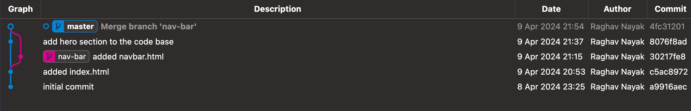
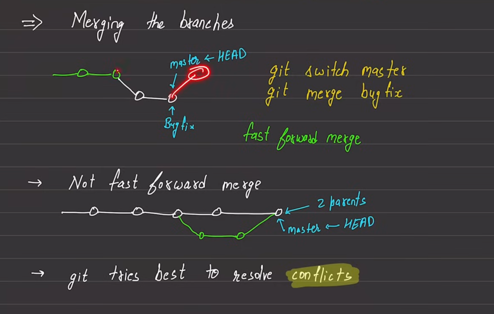
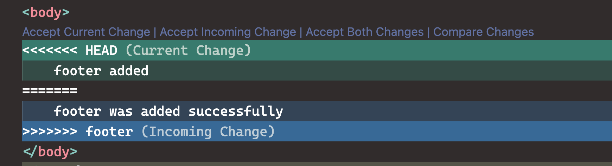

```sh
$ pwd
/git_learning/dir_two

$ git init
hint: Using 'master' as the name for the initial branch. This default branch name
hint: is subject to change. To configure the initial branch name to use in all
hint: of your new repositories, which will suppress this warning, call:
hint:
hint: 	git config --global init.defaultBranch <name>
hint:
hint: Names commonly chosen instead of 'master' are 'main', 'trunk' and
hint: 'development'. The just-created branch can be renamed via this command:
hint:
hint: 	git branch -m <name>
Initialized empty Git repository in /Users/raghavnayak/Developer/Programming/git_learning/dir_two/.git/
```

see `hint: Using 'master' as the name for the initial branch. This default branch name` 

### branch
Once you add your first commit, you can run `git commit`

```sh
$ git branch
* master
```

- branch is like an alternative timeline.
- you will always be on some branch.

master/main branch

```sh
commit c5ac8972b149f53dbe6e8302ea9b03d832f42a67 (HEAD -> master)
Author: Raghav Nayak <abc@example.com>
Date:   Tue Apr 9 20:53:18 2024 +0530

    added index.html

commit a9916aecd146cfde250f18f98385fcb8707ee9e0
Author: Raghav Nayak <abc@example.com>
Date:   Mon Apr 8 23:25:14 2024 +0530

    initial commit
```

```sh
$ cat .git/refs/heads/master
c5ac8972b149f53dbe6e8302ea9b03d832f42a67
```

creating a branch
```sh
$ git branch nav-bar

$ git branch
* master
  nav-bar

$ tree
.
├── heads
│   ├── master
│   └── nav-bar
└── tags

2 directories, 2 files
```

moving from one branch to another
you can use `checkout` or `switch` option
```sh
$ git checkout nav-bar
Switched to branch 'nav-bar'

$ git switch nav-bar
Switched to branch 'nav-bar'

$ git branch
  master
* nav-bar

$ cat .git/HEAD
ref: refs/heads/nav-bar

$ cat .git/refs/heads/nav-bar
c5ac8972b149f53dbe6e8302ea9b03d832f42a67
```

As we have not done anything after changing the branch, both master and nav-bar are pointing to the same commit hash.

After making a commit in nav-bar branch
```sh
$ git log
commit 30217fe86a3f895f143290464b99af2883ba7525 (HEAD -> nav-bar)
Author: Raghav Nayak <abc@example.com>
Date:   Tue Apr 9 21:15:05 2024 +0530

    added navbar.html

commit c5ac8972b149f53dbe6e8302ea9b03d832f42a67 (master)
Author: Raghav Nayak <abc@example.com>
Date:   Tue Apr 9 20:53:18 2024 +0530

    added index.html

commit a9916aecd146cfde250f18f98385fcb8707ee9e0
Author: Raghav Nayak <abc@example.com>
Date:   Mon Apr 8 23:25:14 2024 +0530

    initial commit


$ cat .git/refs/heads/nav-bar
30217fe86a3f895f143290464b99af2883ba7525

$ cat .git/HEAD
ref: refs/heads/nav-bar
```

The head points to the current branch latest commit.

you can use `switch -c` and `checkout -b` options to create a new branch and to move to the newly created branch.


### merging of branch
==fast forward==
- you will be working on the new branch and once you are done with the changes, you will merge master with the new branch.

==not fast forward branch==
- master and working branch are having different heads.

```sh
$ git merge nav-bar
Merge made by the 'ort' strategy.
 nav-bar.html | 7 +++++++
 1 file changed, 7 insertions(+)
 create mode 100644 nav-bar.html

$ git log --oneline
4fc3120 (HEAD -> master) Merge branch 'nav-bar'
8076f8a add hero section to the code base
30217fe (nav-bar) added navbar.html
c5ac897 added index.html
a9916ae initial commit
```
as you can see, the commits of nav-bar are now visible in master branch's logs.



you can delete a branch by 
```sh
$ git branch -d nav-bar
Deleted branch nav-bar (was 30217fe).

$ git branch
* master
```
once you delete the branch, all the merged and commit changes can be seen in master branch.


### conflicts



```sh
$ git merge footer
Auto-merging index.html
CONFLICT (content): Merge conflict in index.html
Automatic merge failed; fix conflicts and then commit the result.
```



top part is from current branch
bottom part shows the branch and incoming changes.